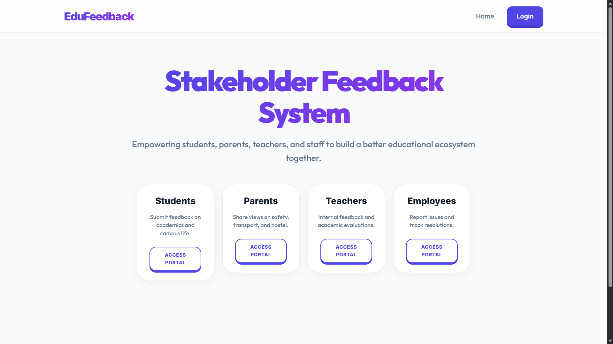

# 🎓 Stakeholder Feedback System

A premium, full-stack feedback management ecosystem designed for educational institutions. This platform empowers students, parents, teachers, and employees to provide structured feedback, track complaints, and assess institutional performance through a modern, 3D-animated interface.

---

## 🚀 Features

### 👥 Multi-Role Ecosystem
- **Student Dashboard**: Submit feedback, evaluate teachers, and track ticket status.
- **Parent Portal**: Share concerns regarding campus facilities, safety, and transport.
- **Teacher Dashboard**: Provide internal feedback and view anonymous performance insights.
- **Employee Portal**: Report operational issues and administrative feedback.
- **Admin Command Center**: Centralized management for all tickets, role-based user registration, and real-time system-wide analytics.

### 🛠️ Core Functionalities
- **3D Interactive UI**: A high-end user experience with smooth animations and responsive design.
- **Anonymous Mode**: Option to hide identity for sensitive reports.
- **Ticket Lifecycle**: Full tracking from *Open* → *In Progress* → *Resolved*.
- **Data Visualization**: Interactive charts (Chart.js) for departmental load, teacher ratings, and submission trends.
- **Evidence Support**: Integrated file upload system for attachments (images/PDFs).
- **Data Export**: One-click CSV report generation for administrative reviews.

---

## 💻 Tech Stack

- **Frontend**: HTML5, CSS3 (Modern 3D Design), JavaScript (Vanilla ES6+)
- **Backend**: Node.js, Express.js
- **Database**: SQLite3 (managed via Knex.js)
- **Authentication**: JWT (JSON Web Tokens) & Bcrypt hashing
- **Visuals**: Chart.js, FontAwesome, Outfit & Inter Google Fonts

---

## 🛠️ Installation & Setup

### Prerequisites
- [Node.js](https://nodejs.org/) (v16 or higher)
- NPM (included with Node.js)

### 1. Clone the repository
```bash
git clone https://github.com/Darshan007-code/stakeholder-feedback-system.git
cd stakeholder-feedback-system
```

### 2. Setup Backend
```bash
cd backend
npm install
node index.js
```
The server will start on `http://localhost:5000`.

### 3. Run Frontend
Simply open `frontend/index.html` in your browser, or use the **Live Server** extension in VS Code.

---

## 🔑 Test Credentials (Password: `pass`)

| Role | User ID | Features |
| :--- | :--- | :--- |
| **Admin** | `ADMIN01` | Management & Analytics |
| **Student** | `1RV22CS034` | Feedback & Evaluation |
| **Teacher** | `EMP102` | Insights & Admin Feedback |
| **Employee** | `EMP205` | Operational Reporting |
| **Parent** | `PAR501` | Campus Feedback |

---

## 📸 Screenshots

### Homepage (3D Stakeholder Grid)


---

## 📄 License
This project is for educational purposes. Feel free to use and modify!
